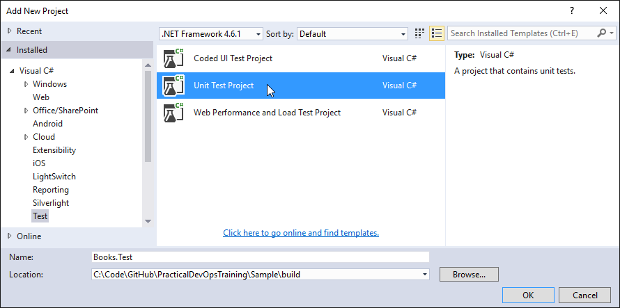
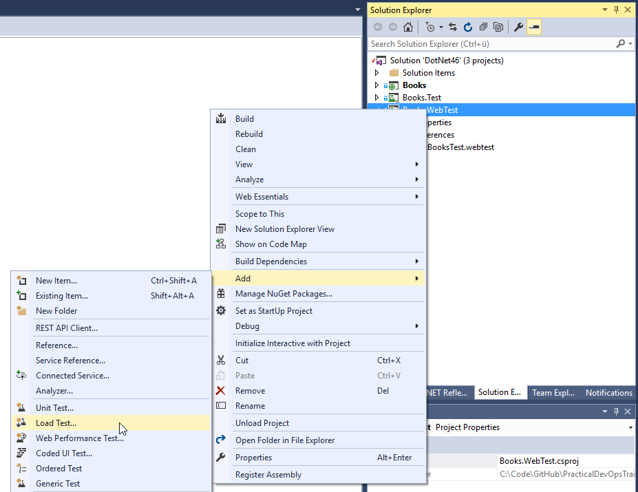

# Exercise 3


## Learnings

1. Basics about test projects
1. Mocking dependencies using *Fakes*
1. Hosting Web API in tests using OWIN
1. Creating an automated Web Test


## Add Test Project

1. **Discussion points:**
   * Describe why test automation is very important for short iteration times and continuous delivery
   * Discuss different types of automated tests (e.g. unit tests, integration tests, automated UI tests, etc.)
   * Discuss the importance of fast tests (e.g. less costs for hosted build controllers, fast tests are executed more often, less waiting time for dev teams, etc.) and how mocking of backend services can help to achieve that 

1. Add a test project to your Visual Studio solution.<br/>
   

1. Remove generated `UnitTest1.cs`.

1. Switch to latest version of .NET (4.6.1) in the Books.Test project properties page just like you did for the Books project in exercise 1

1. Add a reference to the Web API project from your new test project.<br/>
   

1. Add references to the following framework assemblies:
   * `System.ComponentModel.Composition`
   * `System.ComponentModel.Composition.Registration`
   * `System.Reflection.Context`

1. Install necessary NuGet packages by running the following commands in Visual Studio's *Package Manager Console* (you can use *Manage NuGet Packages for Solution* instead if you prefer GUI over PowerShell):
   * `Install-Package Microsoft.AspNet.WebApi.Owin -Project Books.Test`
   * `Install-Package Microsoft.Owin.Host.SystemWeb -Project Books.Test`
   * `Install-Package Microsoft.AspNet.WebApi.OwinSelfHost -Project Books.Test`


## Add and Run Tests

1. **Discussion points:**
   * Describe the concept of mocking
   * Short introduction to Microsoft Fakes (shims vs. stubs)

1. Add *Fakes* assembly for `Books` reference:<br/>
   
   
1. Replace `Fakes/Books.fakes` with the following code:
   ```
    <Fakes xmlns="http://schemas.microsoft.com/fakes/2011/">
        <Assembly Name="Books"/>
        <StubGeneration>
            <Clear/>
            <Add TypeName="INameGenerator"/>
        </StubGeneration>
        <ShimGeneration>
            <Clear/>
        </ShimGeneration>
    </Fakes>
   ```

1. Copy `.cs` files from [Assets/Exercise-3-Tests](Assets/Exercise-3-Tests) into your test project. Make yourself familiar with the two test files.

1. **Discussion points:**
   * Short introduction into unit testing with Visual Studio
   * Describe how OWIN is used to host a web server in an integration test (`IntegrationTest.cs`)

1. Build your test project. There should not be errors.

1. Open Visual Studio's *Test Explorer* and run all tests.<br/>
   


## Add Web Test

1. **Discussion points:**
   * Describe different type of web testing (e.g. API testing, end-to-end testing)
   * Mention and describe other important web test tools (e.g. [Protractor](http://angular.github.io/protractor/#/) for AngularJS, [Selenium](http://www.seleniumhq.org/) for browser automation) and their integration in Visual Studio (e.g. blog article [Getting Started with Selenium Testing in a Continuous Integration Pipeline with Visual Studio](https://blogs.msdn.microsoft.com/visualstudioalm/2016/01/27/getting-started-with-selenium-testing-in-a-continuous-integration-pipeline-with-visual-studio/))
   * Short introduction to Visual Studio Web Tests

1. Add a new *Web Performance and Load Test Project*.<br/>
   

1. Rename test to `GetBooksTest`<br/>
   

1. Add web request to our *Get Books* Web API.<br/>
   

1. **Discussion points:**
   * Describe other capabilities of Visual Studio Web Tests (e.g. loops, conditions, data-driven tests, parameters)

1. Open the request's properties and change the URL appropriately.<br/>
   

1. **Discussion points:**
   * Describe other request properties offered by Visual Studio

1. Parameterize web server. This is important if you have lots of requests. With parameters, tests become much easier to maintain.<br/>
   

1. Make yourself familiar with the web test after server parameterization.<br/>
   

1. **Discussion points:**
   * Describe other request properties offered by Visual Studio
   * Describe validation rules
   
1. Start an instance of your OWIN web server (press *Ctrl+F5* to start it without debugger).

1. Run the web test.<br/>
   
   
1. Verify that test was successful.<br/>
   


## Add Load Test

1. **Discussion points:**
   * Discuss the importance of load testing
   * General overview over Visual Studio load testing capabilities

1. Add load test to web test project.<br/>
   

1. Select the following test settings (select default values for settings not mentioned here):
   * Select *On-premise Load Test* (we will move to the cloud later)
   * 100 test iterations
   * 5 seconds sampling rate
   * Constant load of 10 users
   * Add the `GetBooksTest` to the load test

1. **Discussion points:**
   * Describe other capabilities of Visual Studio load testing

1. Run load test.<br/>
   

1. Analyze load test results.<br/>
   


## Further Ideas

If you have time left, you could additionally cover topics like:

* Create [custom validation rule](https://msdn.microsoft.com/en-us/library/ms182556.aspx)
* Use web UI from final sample code to demo HTML-related web test features
* (Not recommended but possible if you have a very web-development-oriented audience) Add a Jasmine unit test for Angular client
