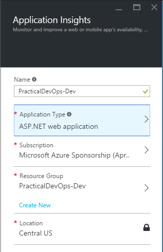
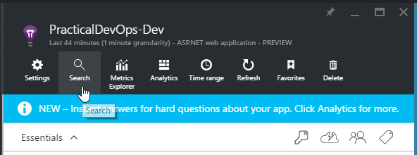

# Exercise 4


## Learnings

1. Basics about Application Insights
1. Connecting to Application Insights using instrumentation key


## Create Application Insights

1. Open [Azure Portal](https://portal.azure.com) and sign in.

1. Add *Application Insights* named `PracticalDevOps-Dev` to the resource group `PracticalDevOps-Dev`.<br/>
   

1. Copy *Instrumentation Key* from Azure Portal<br/>
   


## Configure Application to Use Application Insights   

1. Add the `InstrumentationKey` setting to your `web.config` file.
   ```
    <?xml version="1.0" encoding="utf-8"?>
    ...
    <configuration>
        <appSettings>
            <add key="MinimumNumberOfBooks" value="1"/>
            <add key="MaximumNumberOfBooks" value="5"/>
            <add key="BookNameTokenUrl" value="..."/>
            <add key="InstrumentationKey" value="ba2c0764-5cfb-4741-a8e1-fb150b175a7d"/>
        </appSettings>
        ...
    </configuration>
   ```

1. Add code setting the instrumentation key to `Startup.cs`:
   ``` 
    public void Configuration(IAppBuilder app)
    {
        TelemetryConfiguration.Active.InstrumentationKey = ConfigurationManager.AppSettings["InstrumentationKey"];

        // Allow CORS
        app.UseCors(CorsOptions.AllowAll);
        ...
    }
   ```

1. Add custom event tracking to `Controllers/BooksController.cs`:
   ```
    [HttpGet]
    [Route("books")]
    public async Task<IEnumerable<Book>> Get()
    {
        var numberOfBooks = new Random().Next(this.options.MinimumNumberOfBooks, this.options.MaximumNumberOfBooks + 1);

        var telemetryClient = new TelemetryClient();
        telemetryClient.TrackEvent($"Generating {numberOfBooks} books");

        var result = new Book[numberOfBooks];
        ...
    }
   ```


## Run Application and View Telemetry

1. Run all your tests to make sure you did not break something.

1. Run application locally and refresh `http://localhost:2690/api/books` multiple times.

1. Open *Search* in Application Insights.<br/>
   

1. See if your application telemetry appears.

1. Open *Application Insights Search* in Visual Studio while debugging your application. Refresh `http://localhost:2690/api/books` multiple times. See if your application telemetry appears.<br/>
   
   
 