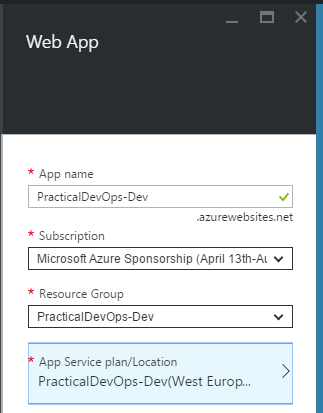
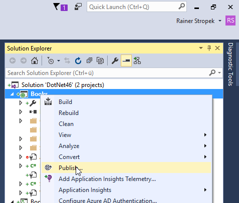
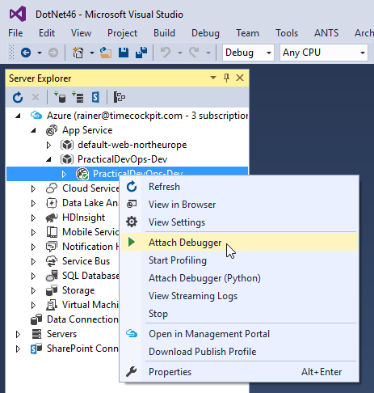

# Exercise 5

## Learnings

1. Creating App Services Web Apps
1. Publish web apps manuall from Visual Studio
1. Basic configuration (here: enable remote debugging) of web apps
1. Connecting to Azure using Visual Studio Server Explorer
1. Remote debugging of web apps

## Add Web App

1. Open [Azure Portal](https://portal.azure.com) and sign in.

1. Add *Web App* named `PracticalDevOps-Dev` (you might have to replace this with another name if it has already been taken) to the resource group `PracticalDevOps-Dev`. Make sure that the App Service plan is in the same Data Center Region as your storage account. 
   

1. **Discussion points:**
   * Introduction to Azure App Services Web Apps
   * Difference IaaS vs. PaaS (control vs. cost-efficiency)

1. Once the web app has been created, go to the *Tools* section. 
   
   
1. In the *Extensions* tool, add *Application Insights* to your web app. 
    

## Publish From Visual Studio

1. **Discussion points:**
   * Why manual deployment only for dev environments?
   * Value of automating build-, test-, and deployment processes
   * Describe different publishing methods for Web Apps (WebDeploy, FTP, Kudu/Git)

1. Start *Publish* wizard in Visual Studio. 
   

1. Connect to your Azure subscription as choose the previously created Web App as your deployment target. **Make sure you deploy a Debug version of your app**.

1. Watch Visual Studio deploying your Web API using WebDeploy.

1. **Discussion points:**
   * Security-related issues regarding publishing profiles, publish settings files, etc.

1. Try to open `http://practicaldevops-dev.azurewebsites.net/api/books`. You should receive results. Refresh the page multiple times.

1. Look for telemetry from your deployed application in Application Insights.

## Update and Run Web Test

1. Open the web test created in [exercise 3](exercise03.md).

1. Change web server to deployment in the cloud. 
   
   
1. Run web test to see if it succeeds for deployed version.

1. Open the load test created in [exercise 3](exercise03.md).

1. Run load test to see performance for deployed version.

## Remote Debugging

1. **Discussion points:**
   * Troubleshooting options for Web Apps

1. Enable remote debugging for your web app in the Azure portal. 
   

1. Open Visual Studio's *Server Explorer* and attach a debugger to your deployed web app. This operation may take a few moments. 
   

1. Open `Controllers/BooksController.cs` and set a breakpoint (F9) to the first line of the `Get` method. This operation may take a few moments.

1. Open `http://practicaldevops-dev.azurewebsites.net/api/books` in a browser and note how you can debug the deployed version of your web app with your local Visual Studio.

   
## Further Ideas

If you have time left, you could additionally cover topics like:

* Show Kudu *scm* service at `https://<sitename>.scm.azurewebsites.net/`
* Show FTP access to Web Apps (e.g. for downloading logs)
* Show Visual Studio Online for interactive access to Web App content
* Demonstrate deployment slots and VIP swaps
* Move on to [exercise 6](exercise06.md) as it is a bit longer. You could use the additional time to dive deeper into build-, test-, and release-automation.