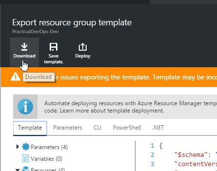
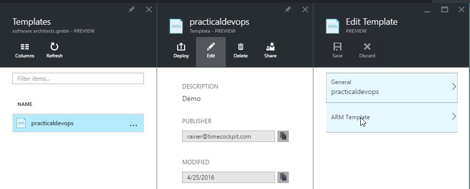
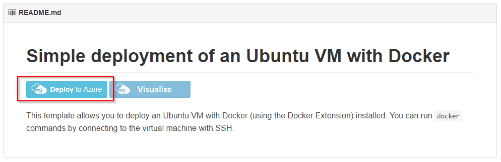
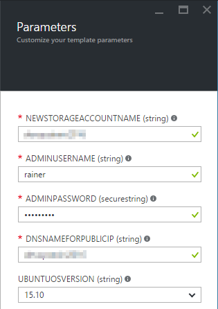
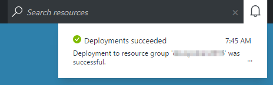

# Exercise 7

## Learnings

1. Basics about ARM Templates
1. Exporting ARM Templates
1. Downloading ARM Templates
1. Editing and deploying ARM Templates in the Azure Portal
1. Deploying a VM using an Azure ARM Quickstart

## Export Template

1. Open [Azure Portal](https://portal.azure.com) and sign in.

1. Trigger *Template Export* for Resource Group `PracticalDevOps-Dev`: 
   

1. Download exported template and make yourself familiar with the code. 
   

1. **Discussion points:**
   * Describe basic concepts of Azure Resource Manager and ARM templates
   * Speak about structure of ARM templates (e.g. parameters, variables, resources, etc.)
   * Point out the use of [template functions](https://azure.microsoft.com/en-us/documentation/articles/resource-group-template-functions/)
   * Code walk-through for generated PowerShell scripts

## Edit and Deploy Using PowerShell

If you are very familiar with PowerShell, you can do the following steps using the downloaded code instead of editing and deploying it in the Azure Portal.

## Edit and Deploy Using Azure Portal

1. Save the exported template using the name `PracticalDevOps`. 
   

1. Edit the ARM template in Azure Portal. 
   
   
1. Replace all `-dev` by `-test` and save the changed template.

1. Deploy changed template with the following parameters. This step might take a while. 
   
   

## Use ARM Quickstart Template from GitHub

1. Open [Azure Quickstart Templates](https://github.com/Azure/azure-quickstart-templates/tree/master/) on GitHub.

1. Take a look at Quickstart Templates on GitHub. In particular, look for the `docker-simple-on-ubuntu` template ([link](https://github.com/Azure/azure-quickstart-templates/tree/master/docker-simple-on-ubuntu)).

1. Take a look at the UI for the Quickstart Templates [in the Azure Portal](https://azure.microsoft.com/en-us/documentation/templates/). Again, look for the *Deploy an Ubuntu VM with Docker Engine* template ([link](https://azure.microsoft.com/en-us/documentation/templates/docker-simple-on-ubuntu/)). 

1. **Discussion points:**
   * Why are the Quickstart Templates so useful?
   * Describe different ways of deploying them (PowerShell, using the embedded *Deploy to Azure* button)
   * How does the *Deploy to Azure* mechanism work?

1. In the next example, we are going to need a [Docker](https://www.docker.com/) host. Use the button *Deploy to Azure* in the [Quickstart Template](https://github.com/Azure/azure-quickstart-templates/tree/master/docker-simple-on-ubuntu) to deploy a Docker host in your Azure subscription. 
   

1. Use the following settings when deploying the Docker host (note that you have to choose your own unique names for storage account and DNS name): 
   

1. Make sure that your deployment was successful. If it was, you are prepared for the next exercise. 
   

   
## Further Ideas

If you have time left, you could additionally cover topics like:

* Demonstrate ARM template support in Visual Studio
* Create and deploy ARM template from scratch using Visual Studio project
* Deploy ARM template using a PowerShell script
* Deploy a more complex template from Azure Quickstarts
