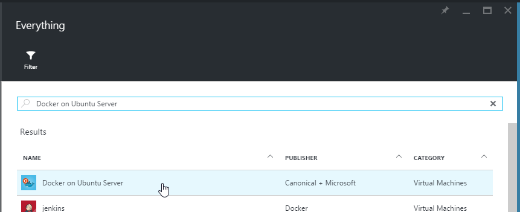

# Exercise 8

## Learnings

1. Basics about new project system in ASP.NET Core 1.0
1. Running web app with cross-platform web server Kestrel
1. Basics about Node.js-based web tools in Visual Studio 2015
1. 

## ASP.NET Core 1 Web App in Visual Studio 2015

1. Open [Sample/AspNetCore1.sln](../Sample/) in Visual Studio 2015.

1. Build the solution and make sure that there are no errors.

1. In Visual Studio, look at `project.json` and make yourself familiar with the code.

1. Use Visual Studio's *Task Runner* to run Gulp task `default`. 
   

## Run ASP.NET Core 1 with Kestrel

1. Open a developer command prompt and navigate to the directory `Sample/AspNetCore1`.

1. Run `dnvm install 1.0.0-rc1-update1 -r coreclr -arch x64` to make sure CoreCLR is installed on your computer.

1. Run `dnvm use 1.0.0-rc1-update1 -r coreclr -arch x64` to select CoreCLR.

1. Run `dnu restore` to restore necessary packages from NuGet.

1. Run `npm install` to restore necessary NPM packages.

1. Run `dnx web` to start your web app using the cross-platform Kestrel web server. 
   

1. Open `http://localhost:5000/index.html` to test your web app.

## Run Web App in a Docker Container

1. Add a *Docker on Ubuntu* VM to your resource group. 
   
   
1. Use an SSH Client (on Windows e.g. *PuTTY*) and connect to your new VM.

1. Make sure that Docker is up and running using: `docker info`

1. Clone the sample repository for this training: `git clone https://github.com/rstropek/PracticalDevOpsTraining.git`

1. Get Microsoft's Docker image for ASP.NET Core: `docker pull microsoft/aspnet` 

1. Start a new interactive Docker container: `docker run -it -p 5000:5000 -v ~/PracticalDevOpsTraining/Sample/AspNetCore1:/src microsoft/aspnet /bin/bash`

1. Inside of the Docker container, navigate to the mounted `src` folder: `cd src`

1. Restore NuGet packages: `dnu restore`

1. Run our sample in the Docker container: `dnx web`

1. If you want to try calling our Web API using your browser, don't forget to open port 5000 for your Docker VM. 
   

1. In your browser, open `http://yourvmname.cloudapp.net:5000/api/books`.

## Create Docker Image for Web App

1. Exit from Docker container **but stay on Docker VM**.

1. Navigate to `PracticalDevOpsTraining/Sample`: `cd ~/PracticalDevOpsTraining/Sample`

1. Build image from `Dockerfile`: `docker build -t myaspnet .`

1. Run container from image: `docker run -d -p 5000:5000 myaspnet`

1. Use `docker ps` and `docker logs` to make sure your container is up and running.

1. If you want to try calling our Web API using your browser, don't forget to open port 5000 for your Docker VM. 
   

1. In your browser, open `http://yourvmname.cloudapp.net:5000/api/books`.
