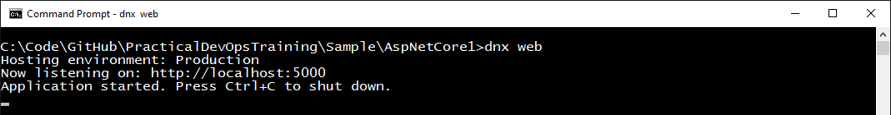
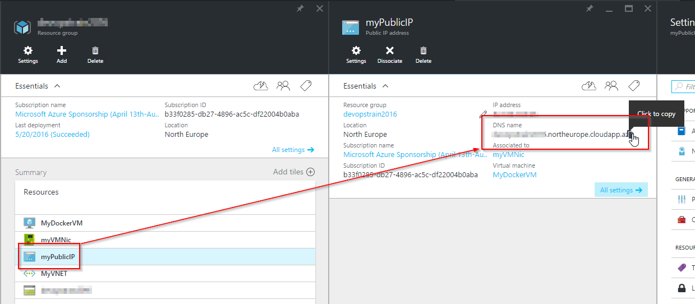

# Exercise 8

## Learnings

1. Basics about new project system in ASP.NET Core 1.0
1. Running web app with cross-platform web server Kestrel
1. Basics about Node.js-based web tools in Visual Studio 2015
1. Running ASP.NET Core web apps in a Docker container
1. Packaging ASP.NET Core web apps in Docker images using a `Dockerfile`

## ASP.NET Core 1 Web App in Visual Studio 2015

1. Open [Sample/AspNetCore1.sln](../Sample/) in Visual Studio 2015.

1. Build the solution and make sure that there are no errors.

1. In Visual Studio, look at `project.json` and make yourself familiar with the code.

1. **Discussion points:**
   * New project structure (`.xproj`)
   * New configuration system (JSON instead of XML, options-pattern, etc.)
   * Dependency injection in ASP.NET Core 1.0
   * Integration of web development tools like NPM, Node.js, Gulp, etc. in Visual Studio
   * Code walk-through for Angular 2.0 code 

1. Use Visual Studio's *Task Runner* to run Gulp task `default`. 
   

## Run ASP.NET Core 1 with Kestrel

1. Open a developer command prompt and navigate to the directory `Sample/AspNetCore1`.

1. **Discussion points:**
   * Describe basics of [ASP.NET Core 1.0 CLI](https://github.com/dotnet/cli/blob/rel/1.0.0/Documentation/intro-to-cli.md)
   * Speak about [changes from RC1 to RC2](http://dotnet.github.io/docs/core-concepts/dnx-migration.html) (see also blog article from [Shawn Wildermuth](https://wildermuth.com/2016/05/17/Converting-an-ASP-NET-Core-RC1-Project-to-RC2))

1. Run `dotnet --help` to make sure ASP.NET Core 1.0 RC2 is installed on your computer.

1. Run `dotnet restore` to restore necessary packages from NuGet.

1. Run `npm install` to restore necessary NPM packages.

1. Run `dotnet run` to start your web app using the cross-platform Kestrel web server. 
   

1. **Discussion points:**
   * Relation of Kestrel and IIS on Windows

1. Open `http://localhost:5000/index.html` to test your web app.

## Run Web App in a Docker Container

1. **Discussion points:**
   * Short introduction into Docker's basic concepts
   * Speak about differences to virtual machines
   * Point out that this exercise uses the Docker host created in the [previous exercise](exercise07.md) 
   
1. Use an SSH Client (on Windows e.g. *PuTTY*) and connect to your the VM you created in [exercise 7](exercise07.md). 
   

1. Make sure that Docker is up and running using: `docker info`

1. Clone the sample repository for this training: `git clone https://github.com/rstropek/PracticalDevOpsTraining.git`

1. Get Microsoft's Docker image for ASP.NET Core: `docker pull microsoft/dotnet:latest` 

1. Start a new interactive Docker container: `docker run -it -p 5000:5000 -v ~/PracticalDevOpsTraining/Sample/AspNetCore1:/src microsoft/dotnet:latest /bin/bash`. This command might take some moments if you run it for the first time. Subsequent calls should be much faster.

1. **Discussion points:**
   * Describe concept of volume mappings (`-v`) and port mappings (`-p`)

1. Inside of the Docker container, navigate to the mounted `src` folder: `cd src`

1. Restore NuGet packages: `dotnet restore`

1. Run our sample in the Docker container: `dotnet run`

1. In your browser, open `http://yourvmname.cloudapp.net:5000/api/books`.

1. Once you are done, exit from your Docker container using `exit`.

1. Look for the container using `docker ps -a`. It should not be stopped. Delete your container using `docker rm`.

## Create Docker Image for Web App

1. Exit from Docker container **but stay on Docker VM**.

1. Navigate to `PracticalDevOpsTraining/Sample`: `cd ~/PracticalDevOpsTraining/Sample`

1. Build image from `Dockerfile`: `docker build -t myaspnet .`

1. **Discussion points:**
   * Speak about basic concepts of Dockerfiles
   * Code walk-through for `Dockerfile`

1. Run container from image: `docker run -d -p 5000:5000 myaspnet`

1. Use `docker ps` and `docker logs` to make sure your container is up and running.

1. In your browser, open `http://yourvmname.cloudapp.net:5000/api/books`.
