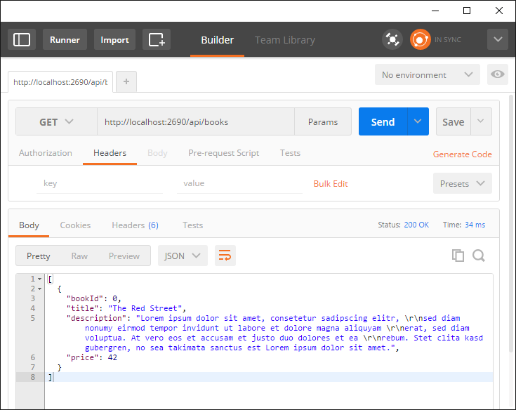

# Exercise Overview

## Introduction

The exercises are used to show different aspects of Microsoft Azure and Visual Studio that are relevant for DevOps. The goal is to have a consistent sample that attendees can build step by step. The sample is simple so that everybody can follow. However, it contains some requirements and implementation details that are typical for real-world web applications.

Note that [Martin Hinshelwood](https://nkdagility.com/company/about-martin-hinshelwood/) has created a modified version based on this training. His version starts with VSTS and Continuous Integration/Delivery from the beginning instead of adding it in exercise 6. You can find this variant of the training [in his GitHub repository](https://github.com/nkdAgility/Practical-DevOps-Workshop).

## Goal of the Sample

The goal of the sample is to implement a simple Web API that could be used in an online book shop. The Web API should return a list of available books with ID, title, description and price.

The sample does not require a backend storage. Therefore, the books are generated at runtime. The number of returned books and their titles should be random. The following screenshot shows a typical result of the Web API:

The generation of the book titles is done by randomly combining three text parts:

* Book titles start with phrases like *The, A, A great, One hell of a*,...
* Then phrases like *Red, Blue, awesome, good, horrible*,... follow
* At the end, phrases like *Street, Road, Car, House*,... are appended

The sample also contains a simple Web UI that consumes the Web API mentioned above:

## Session Structure

* The exercises are built for a **two-days workshop**.
* Every day consists of **four sessions**.
* You can use one exercise per session. However, if you audience is especially initerested in certain topics, you can spend more time on certain exercises and keep the other ones shorter.

## Suggested Session Plan

Here is the suggested session plan. You can follow it or adapt it to your specific needs (e.g. usual start/end times in your region, different audience, venue restrictions, catering etc.):

* Start: 9:00 AM
* Session 1: 9:00 AM – 10:30 AM
    * Welcome, introduction, organizational matters, brief overview of the workshop
    * Check that everybody who wants to follow along has all prerequisites installed
    * Demo/Exercise 1
    * Close with tips from my practical work concerning the topics covered in exercise 1 
* Session 2: 11:00 AM – 12:30 PM 
  (Structure of the following session are all like this one)
    * Discuss open questions from session 1
    * Exercise 2
    * Close with tips from practical work concerning the topics covered in exercise 2 (show some real-world examples from projects the trainer did)
* Session 3: 1:30 PM – 3:00 PM
* Session 4: 3:30 PM – 5:00 PM
* End approx. 5:00 PM
* Day two follows the same pattern
